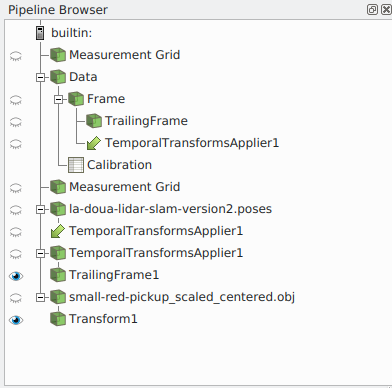

# Animations in Python

- **temporal_animation.py**: this script creates a python animation cue, appends it to the scene animation and plays it. The only animation mode supported for now is 'Snap To TimeSteps'. This is the script that should be run to start the temporal animation. It depends on **temporal_animation_cue.py**.

- **temporal_animation_cue.py**: this script defines the animation. It is defines a python animation cue https://trac.version.fz-juelich.de/vis/wiki/Examples/ParaviewAnimating with its standard three functions: *start_cue* (called once at the beginning), *end_cue* (called once at the end) and *tick* (called at each timestep). It assumes a pipeline with raw lidar frames, a trajectory, remapped lidar frames and a CAD 3D model. The VeloView pipeline should look like this:

Note that a Transform is added after the CAD 3D model because the model is moved by the script to follow the trajectory.

- **non_temporal_animation.py**: this is a another example which creates an animation by moving the camera, but without changing the pipeline time. So it works also on non-temporal data. It also contains an example showing how to add rulers in the scene.

- **camera_path.py**: this file contains the classes which define the camera path. Currently, the following type of camera are implemented:
  - first person view
  - third person view
  - absolute position
  - absolute orbit
  - relative orbit

To create a new animation you should modify **temporal_animation_cue.py** at the two places indicated in the script. First, to set some global parameters and then to specify the camera animation. If you want to have some other parameters changing during the animation, you can add custom code in the *tick* function.
